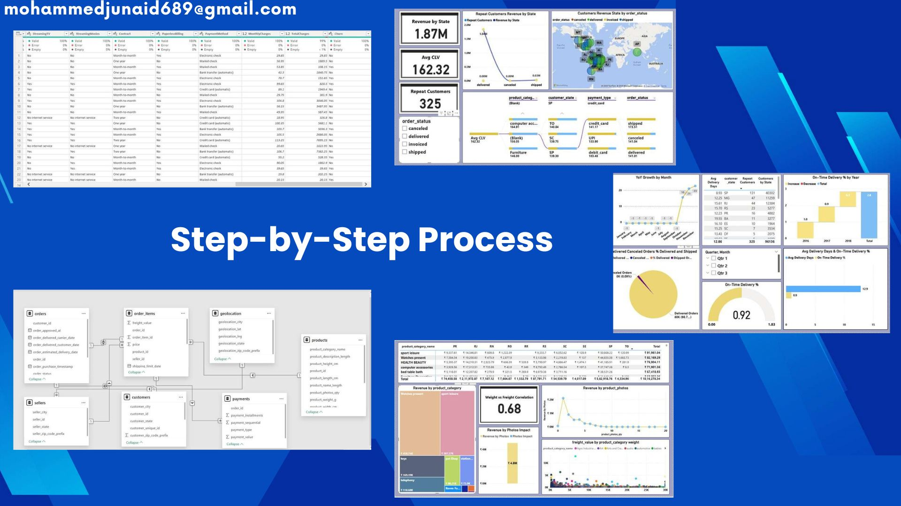
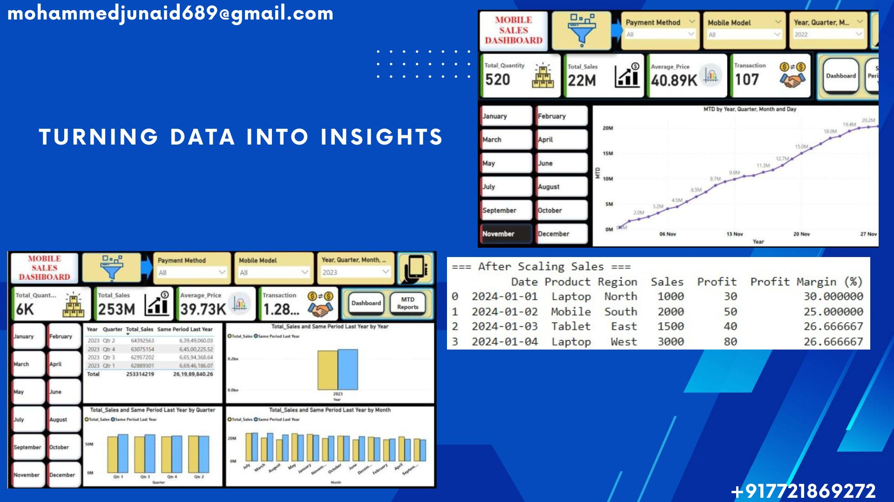

# Turning Data into Actionable Insights — My Approach

In today’s data-driven world, I believe the real value of data lies not just in **collecting it** — but in **turning it into clear, actionable insights** that drive smart decisions.  

---

## 🔹 Step-by-Step Approach  

1. **Define Clear Objectives**  
   - Make the problem crystal clear: *“What exactly do we want to improve or solve with this data?”*  

2. **Collect & Clean Data**  
   - Gather relevant data  
   - Fix duplicates & inconsistencies  
   - Set correct data types  

3. **Analyze & Visualize**  
   - Use **Power BI / Excel / SQL / Python** to find trends, patterns, and KPIs  
   - Keep visuals **simple, easy to understand, and decision-focused**  

4. **Derive Insights**  
   - Go beyond numbers → focus on *“So what?”* and *“What’s next?”*  
   - Provide clear takeaways for action  

5. **Implement & Iterate**  
   - Apply insights → Measure the impact → Improve in the next cycle  

---

##  Tools & Skills  

- **Power BI** → Interactive dashboards, DAX measures, drill-through  
- **Excel** → Pivot Tables, PowerQuery, LOOKUP/XLOOKUP, Charts  
- **SQL** → Joins, CTEs, Window functions, performance basics  
- **Python** → Pandas, basic visualization (Matplotlib), quick EDA  

---

##  Mini SQL Example  

-- Top 5 products by revenue (sample)
SELECT product_name, SUM(quantity * price) AS revenue
FROM sales
GROUP BY product_name
ORDER BY revenue DESC
LIMIT 5;

## Dashboard Previews

    <b>Dashboard Example 1</b> 
 
    <b>Dashboard Example 2</b> 

🌟 About the Project

## This project showcases my ability to:

✔ Define clear business problems

✔ Clean and prepare raw datasets

✔ Build interactive dashboards & perform data analysis

✔ Derive actionable insights that improve decision-making

